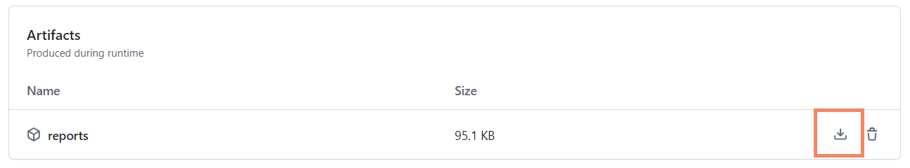

[](https://opensource.org/licenses/Apache-2.0)

# BCTS-conformance-reports

## Overview

Welcome to the BCTS-conformance-reports repository. This page serves as a tool to automate the filtering and generation of the following bi-weekly conformance reports: 
- Annual Development Ready (**DR**) Conformance Summary
- Annual Developed Volume (**ADV**) Confromance Summary
- Development In Progress (**DIP**) Timber Inventory Conformance Summary
- Ready to Develop (**RTD**) Timber Inventory Conformance Summary
- Ready to Sell (**RTS**) Timber Inventory Conformance Summary

This repository leverages GitHub Actions CI (Continuous Integration) to automatically execute the scripts in a virtual environment, where Python and all necessary dependencies are pre-installed. This setup eliminates the need for users to install anything on their local machines. To generate the desired reports, simply upload the base report to the data folder. The actions will run automatically, and the generated reports will be available in the artifacts section.

## File Structure

This repository has the following structure:

```bash
project-folder/
├── data/
│   ├── .gitkeep
│   └── QA_DR_DIP_RTS_HICurrentFiscal-Or-Planned_with_CFSSvrLine_YYYY_MM_DD.xlsxxlsx                        
├── scripts/                
│   ├── ADV_script.py
│   ├── DIP_script.py
│   ├── DR_script.py
│   ├── RTD_script.py
│   └── RTS_script.py
├── img/
├── requirements.txt 
```

The base report (`QA_DR_DIP_RTS_HICurrentFiscal-Or-Planned_with_CFSSvrLine_YYYY_MM_DD.`) should be placed in the `data` directory, while the five scripts in the `scripts` folder are responsible for generating the corresponding reports. Each script reads the base report from the `data` folder and processes it to produce its respective output.

## Usage 

**Important**: Please ONLY modify the base report within the data folder when necessary. DO NOT make changes to or delete any other files in any directories. Altering the scripts or the `requirements.txt` file could disrupt the automation process and result in errors.

### 1. Have your base report ready 

- 1.1 Prepare the base report you want to use on your local machine. Ensure that the report follows the exact naming format: `QA_DR_DIP_RTS_HICurrentFiscal-Or-Planned_with_CFSSvrLine_YYYY_MM_DD.` where `YYYY_MM_DD` should be replaced with the report date. 

### 2. Replace with the old base report with the new one you hope to use
- 2.1 Enter the `data` directory: 


- 2.2 Click on the old base report file that's currently in the directory:


- 2.3 Click on the three dots in the top right corner and select "Delete file." **Note**: NEVER delete the `.gitkeep` file, as doing so will remove the entire `data` folder!


- 2.4 Click on the "Commit changes" button in the top right corner:


- 2.5 Use the automatically generated commit message, and write: Delete old base report for *report_date_for_old_report*, then click on "Commit changes":


- 2.6 Now click on the "Add file" button in the top right corner and select "Upload files":


- 2.7 Write "Added bew base report (*report_date_for_new_report*) in the commit message and click on the "Commit changes" button:


### 3. Check action status 

- 3.1 At this point, uploading the new base report should have triggered the workflow. Return to the main repository page and check the message next to your username. If you see a brown dot, it means the action has started running, and you can click on it to monitor its progress. If the dot isn't visible, refresh the page, and it should appear:


- 3.2 Once you click on the brown dot, you will be able to see the progress showing which stage of the workflow it's currently at:


- 3.3 If the workflow is completed, you will see a green circle with a check mark next to the "build" tab under "Jobs", as well as at the top left, beside the commit message. Once you see this, click on "Summary":


- 3.4 Scroll down to the "Artifacts" section near the bottom. If the workflow ran successfully, you should see a new entry called "reports." You can download it by either clicking directly on the name or by selecting the download button. The file will be a ZIP archive containing all five conformance summaries.



- 3.5 If you accidentally exit this page before navigating to the "Artifacts", simply return to the repo's main page, select the "Actions" tab at the top, click on the most recent action and you will be able to find "Artifacts" section at the bottom of the page:


